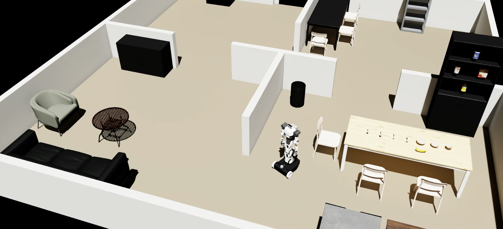

# 🤖 RB-Y1 Isaacsim Simulation with ROS2
This repository provides Isaac-based simulation environments for the [Rainbow Robotics RB-Y1](https://www.rainbow-robotics.com/rby1/en) robot with ROS2 integration. It includes simulation environments configured for basic keyboard teleoperation and mobile manipulation tasks.

This project has been tested and is supported on the following environments and software versions:
* Ubuntu 22.04
* ROS2 Humble
* Isaac sim 5.1.0
* Python (>= 3.10)

## 📌 Notable Improvements
We have improved the official RB-Y1 Isaac Sim asset to ensure stable locomotion. 
[RB-Y1 isaacsim issue](https://github.com/RainbowRobotics/rby1-sdk/issues/127)

> [!CAUTION]
> This is an **unofficial modification** to address simulation stability. Please note that physical coefficients may not perfectly match the real robot.
>
> **Gripper Control Note**: In this simulation, the gripper is controlled via **MoveIt** (`JointTrajectoryController`). Note that the real RB-Y1 robot's gripper is typically controlled directly via Dynamixel SDK/Interfaces.

## 🌐 IsaacSim Installation
See the official [Isaacsim documentation](https://docs.isaacsim.omniverse.nvidia.com/5.1.0/installation/download.html).

## 📂 Installation Our USD
[Download URL](https://drive.google.com/drive/folders/1FwdrhaHXlAxxRLxPmeWcErxue1Za8a3X)

## 💡 ROS2 Interfaces
* ROS2 Topics:

| Message | Description | ROS Topic Name |
|-|-|-|
| Image | RGB image rendered from the head-mounted camera in IsaacSim. The image is at 640/480 resolution with 80 deg VFOV.    | `/rgb` |
| Odometry | Robot base pose and velocity estimated directly from Isaac simulation state. | `/odom` |
| LaserScan | 360° LaserScan in the robot base frame. | `/laser_scan` |
| Twist | Velocity command for differential drive control. | `/cmd_vel` |
| JointState | Joint state feedback from Isaac Sim. | `/joint_states` |
| JointCommand | Joint position commands sent to Isaac Sim. | `/joint_commands` |

### 🖼 Simulation Preview
|  |  |
| :---: | :---: |

## 🦾 MoveIt Integration
We provide direct integration with MoveIt 2 for motion planning and control.
* **Launch**: `ros2 launch rby1_isaac_moveit_config demo.launch.py`
* **Features**:
  * Configured `topic_based_ros2_control` for Isaac Sim bridge.
  * `JointTrajectoryController` for arms, torso, head, and grippers.
  * Motion planning with OMPL, CHOMP, and Pilz Industrial Motion Planner.

## 🗺️ Nav2 Integration
We integration with Nav2 for autonomous navigation.
* **Launch**: `ros2 launch rby1_navigation rby1_navigation.launch.py`
* **Features**:
  * Pre-configured map (`athome_navigation.yaml`) and navigation parameters.
  * AMCL localization and DWB local planner.
  * RViz configuration for navigation.

## 🚧 TODOs
[X] Organize Isaacsim-based RB-Y1 simulation core  
[X] Keyboard teleop & ROS2 Nav2 pkg integration  
[X] Release dual-arm controller   
[ ] Release system-level RB-Y1 simulation evaluation code *(in progress)*

## 🙏 Acknowledgements
This project is built upon the following frameworks and resources:
- [Rainbow Robotics](https://www.rainbow-robotics.com/)
- [ROS2 Documentation](https://docs.ros.org/en/humble/)
- [Nav2](https://docs.nav2.org/)
- [YCB Benchmarks - Object and Model Set](https://www.ycbbenchmarks.com/)
- [Isaac Simulation](https://docs.isaacsim.omniverse.nvidia.com/5.1.0/index.html)
